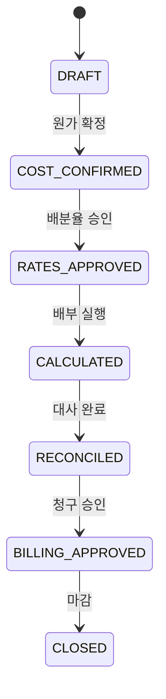
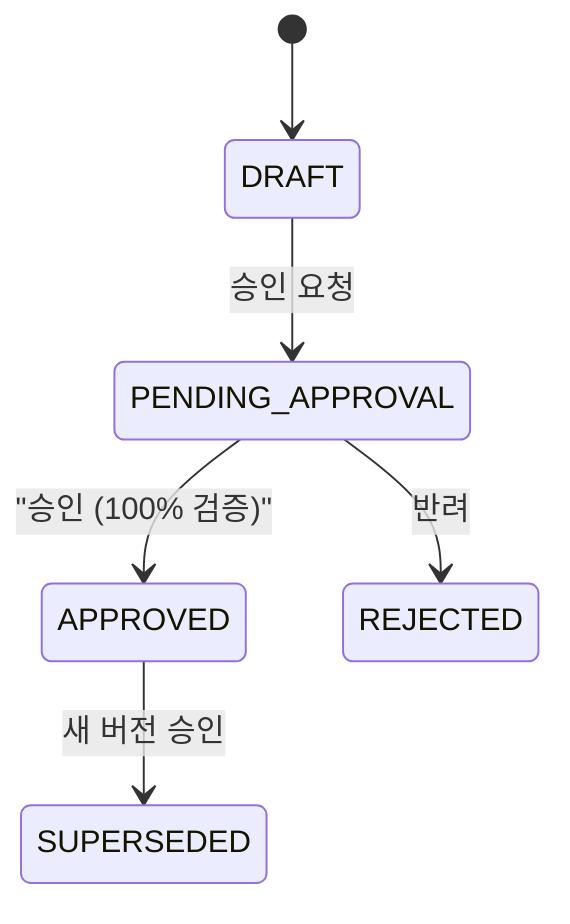
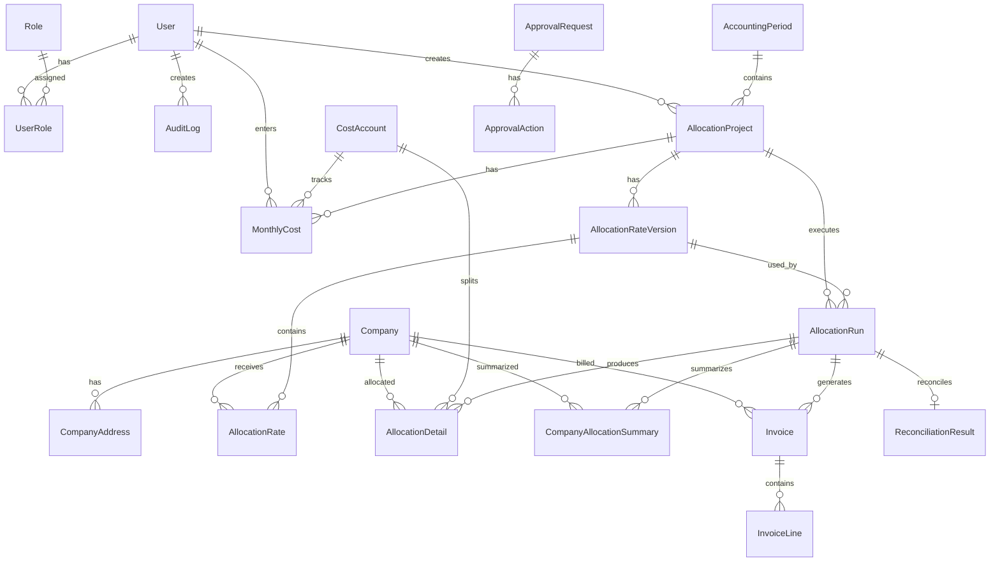

# Architecture & ERD

## Folder Structure

```
src/
├── app/
│   ├── api/                    # REST API routes
│   │   ├── allocation-projects/
│   │   ├── allocation-rates/
│   │   ├── allocation-runs/
│   │   ├── approvals/
│   │   ├── audit-logs/
│   │   ├── companies/
│   │   ├── cost-accounts/
│   │   ├── dashboard/
│   │   ├── exports/
│   │   ├── invoices/
│   │   ├── monthly-costs/
│   │   └── periods/
│   ├── allocation/             # 배부 결과
│   ├── approvals/              # 승인함
│   ├── audit-logs/             # 감사로그
│   ├── companies/              # 법인
│   ├── costs/                  # 원가 입력
│   ├── invoices/               # 청구서
│   ├── projects/               # 프로젝트
│   ├── rates/                  # 배분율
│   └── reconciliation/         # 대사
├── components/
│   ├── layout/
│   └── ui/
└── lib/
    ├── allocation-engine.ts    # 계산 엔진
    ├── math.ts                 # ROUNDDOWN
    ├── services/               # 비즈니스 로직
    ├── auth.ts
    ├── audit.ts
    ├── db.ts
    └── validations.ts
prisma/
├── schema.prisma
├── seed.ts
└── rls-policies.sql
```

## State Transitions

### AllocationProject



### AllocationRateVersion



## Full ERD



## Version Management

- **원가**: `monthly_costs.version` — 마감 후 수정 시 새 version 생성
- **배분율**: `allocation_rate_versions` — APPROVED 버전은 immutable, 변경 시 새 version
- **배부 실행**: `allocation_runs.run_number` — 동일 프로젝트·버전의 FINAL 중복 실행 방지
- **청구서**: `invoices` UNIQUE(run_id, company_id) — 중복 청구 방지

## Data Retention

- Soft delete: `deleted_at` on companies, cost_accounts
- Audit logs: append-only, no delete
- Allocation runs: SUPERSEDED status for historical preservation
